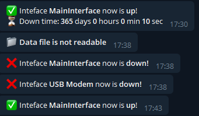

# MultiWan Informer


Language: [Русский](./README_RU.md) | [English](./README.md)

## What is this program created for?

This program is necessary for those who need to monitor the connection of several network cards to the network, thanks to this program you will be able to receive notifications in a telegram about disconnecting or connecting the network on a specific network card

## Screenshots



## How to setup?

To get started, download the assembly artifact, then configure your parameters in the file ```conf.json```

### Settings

<details>
<summary>Config example</summary>

```json
{
    "Interfaces": [{
            "DisplayName": "MainInterface",
            "IpOrInterfaceName": "enp2s0"
        },
        {
            "DisplayName": "SecondInterface",
            "IpOrInterfaceName": "enp3s0"
        }
    ],
    "WaitTimeSec": 15,
    "PingAddr": "8.8.8.8",
    "TelegramConf": {
        "BotToken": "Token",
        "ChatID": "Id",
        "SendSilent": "false"
    }
}
```

</details>

### Parameters

* `Interfaces` - array of interfaces
  * `DisplayName` - the name displayed in the notification
  * `IpOrInterfaceName` - name or own IP address of the interface
* `WaitTimeSec` - how many seconds to wait before a successful ping (```ping -w```)
* `PingAddr` - which address to ping (preferably not a domain)
* `TelegramConf` - bot telegram settings
  * `BotToken` - Telegram bot token ([get it here](https://t.me/BotFather/))
  * `ChatID` - telegram user/channel id ([get it here](https://t.me/chatIDrobot/))
* `SendSilent` - send messages without sound

## Build

Build for your system:
</br>```build -o ./build/multiwan_informer ./src/main.go```

Build example for MIPS:
</br>```GOOS=linux GOARCH=mipsle GOMIPS=softfloat go build -o ./build/multiwan_informer_mipsle ./src/main.go```

## License

Distributed under the GPLv3 License. See [`LICENSE`](./LICENSE) for more information.
